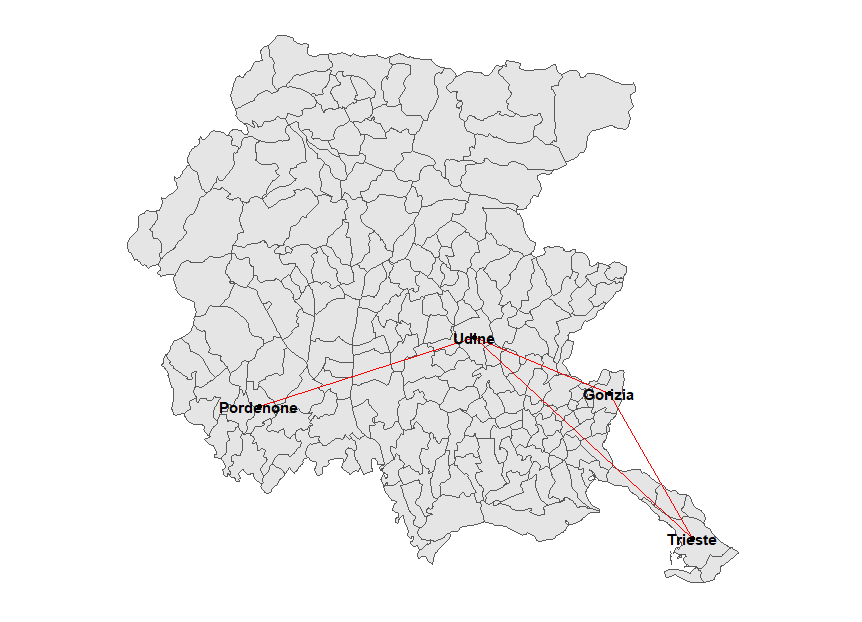
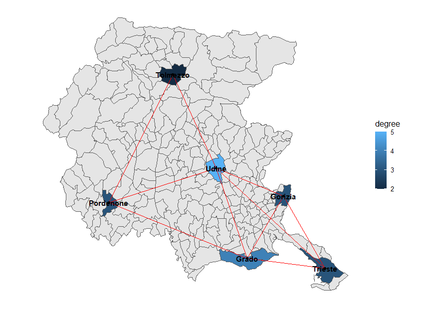

<!-- README.md is generated from README.Rmd. Please edit that file -->

```{r, include = FALSE}
knitr::opts_chunk$set(
  collapse = TRUE,
  comment = "#>",
  fig.path = "man/figures/",
  out.width = "100%"
)
```

# netmap

<!-- badges: start -->
<!-- badges: end -->

Netmap is a package that aids in the visualizations of network objects (made with the `network` or the `igraph` package) on geographical maps, imported through `sf`. Vertices in the network are linked with features in the `sf` object either directly if they share a common attribute or by an optional look-up table.
The package either creates data frames that can be used in a `ggplot2` plot or adds to `sf` features attributes like centrality indices or variables representing connections to a certain node.

## Installation

You can install the development version of netmap from [GitHub](https://github.com/) with:

``` {r eval=FALSE}
# install.packages("devtools")
devtools::install_github("artod83/netmap")
```

## Example

We take a network object, where each vertex is a geographical object, and overlay the network on the map. I.e. a network could represent direct bus routes between cities. 
We can plot the network as overlayed on the complete map or just the 4 cities in the network
The Friuli Venezia Giulia region in northeastern Italy has four major cities: from east to west, Trieste, Gorizia, Udine and Pordenone. Let's imagine that we want to plot a network with these cities as vertices and edges between Trieste and Gorizia, Gorizia and Udine, Trieste and Udine and Udine and Pordenone.

```{r network_overlay, eval=FALSE}
library(ggplot2)
library(netmap)
data(fvgmap)
routes=network::network(matrix(c(0, 1, 1, 0, 
                                 1, 0, 1, 0, 
                                 1, 1, 0, 1, 
                                 0, 0, 1, 0), nrow=4, byrow=TRUE))
network::set.vertex.attribute(routes, "names", value=c("Trieste", "Gorizia", "Udine", "Pordenone"))
routes_df=netmap::ggnetmap(routes, fvgmap, m_name="Comune", n_name="names")
ggplot() +
  geom_sf(data=fvgmap) +
  ggnetwork::geom_edges(data=routes_df, aes(x=x,y=y, xend=xend, yend=yend), colour="red") +
  ggnetwork::geom_nodes(data=routes_df, aes(x=x,y=y)) +
  ggnetwork::geom_nodetext(data=routes_df, aes(x=x,y=y, label = Comune), fontface = "bold") +
  theme_blank()
```
```{r plot_1, echo=FALSE, eval=TRUE}

```

It is also possible to plot a sf object with centrality measures of the network:

```{r centrality, eval=FALSE}
routes2=network::network(matrix(c(0, 1, 1, 0, 0, 1 ,
                                 1, 0, 1, 0, 0, 1,
                                 1, 1, 0, 1, 1, 1,
                                 0, 0, 1, 0, 1, 1,
                                 0, 0, 1, 1, 0, 0,
                                 1, 1, 1, 1, 0, 0), nrow=6, byrow=TRUE))
network::set.vertex.attribute(routes2, "names", 
                              value=c("Trieste", "Gorizia", "Udine", "Pordenone", 
                                      "Tolmezzo", "Grado"))
lkpt=data.frame(Pro_com=c(32006, 31007, 30129, 93033, 30121, 31009), 
                names=c("Trieste", "Gorizia", "Udine", "Pordenone", "Tolmezzo", 
                        "Grado"))
routes2_df=netmap::ggnetmap(routes2, fvgmap, lkpt, m_name="Pro_com", n_name="names")
map_centrality=netmap::ggcentrality(routes2, fvgmap, lkpt, m_name="Pro_com", 
                                    n_name="names", par.deg=list(gmode="graph"))
ggplot() +
  geom_sf(data=fvgmap) +
  geom_sf(data=map_centrality, aes(fill=degree)) +
  ggnetwork::geom_edges(data=routes2_df, aes(x=x,y=y, xend=xend, yend=yend), colour="red") +
  ggnetwork::geom_nodes(data=routes2_df, aes(x=x,y=y)) +
  ggnetwork::geom_nodetext(data=routes2_df, aes(x=x,y=y, label = names), fontface = "bold", colour="") +
  theme_blank()
```

```{r plot_2, echo=FALSE, eval=TRUE}

```

Just the network can be plotted as well without using `ggplot2`. For this purpose, 
a simple layout function, `network.layout.extract_coordinates`, is provided for use with `plot.network` or `plot.igraph`. A user-friendly wrapper, `netmap_plot`, is available.
