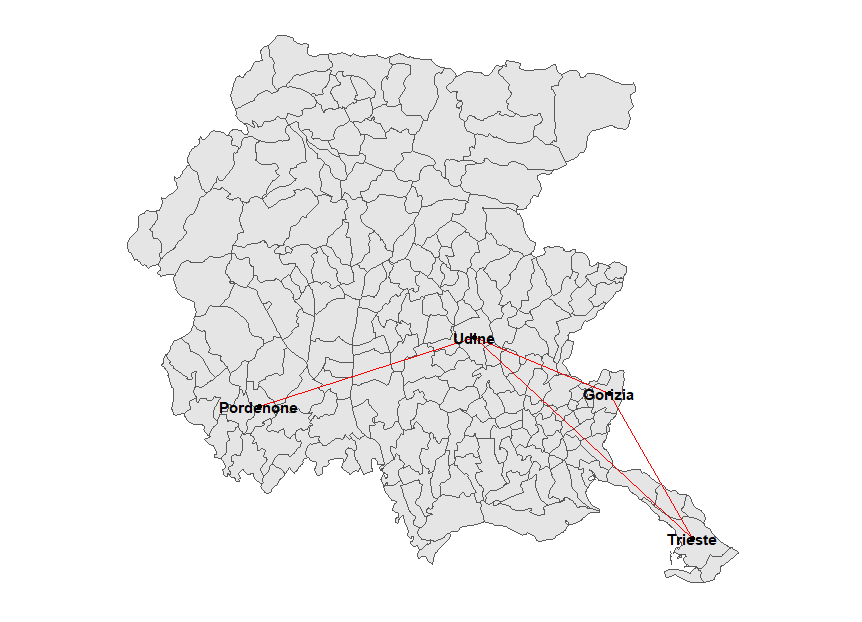
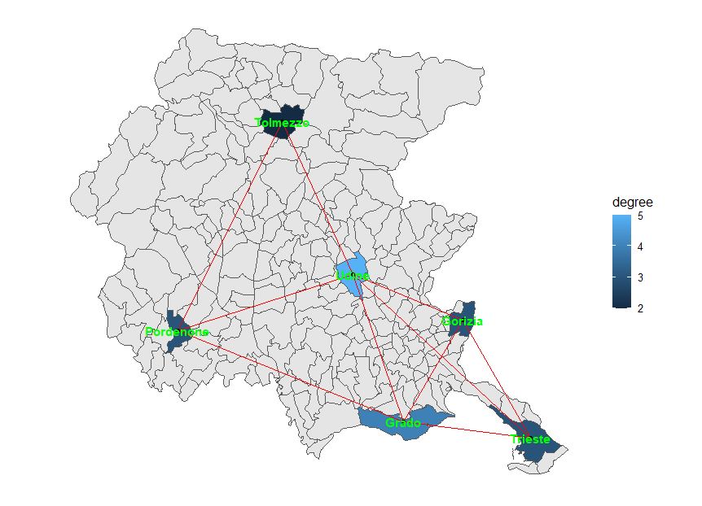

```{r, include = FALSE}
knitr::opts_chunk$set(
  collapse = TRUE,
  comment = "#>"
)
```

## Introduction

Some data sets are relational data sets, they represent relations between their units and which unit is connected to which ones, with a wide range of reasons for two units to be considered linked or not (family/kinship, trade, membership in a club etc.). Other data sets have a geographical, spatial component: each unit represents a part of the physical world, like a river, a city, a country, a landmark. Some data sets are both: relational data sets (networks) can be about units that have an inherent spatial aspect - trade networks between regions, relationships between users for which location data is available, traffic relationships between areas and so on. Network visualization is *hard* and most methods to visualize a network focus on displaying vertices and edges (loosely speaking, units of the network and relationships between them, respectively) in a way that highlights the properties of the network itself. When vertices already have a spatial component, though, a "natural" visualization is just to plot the vertices in their spatial position and display the edges between them. This may make the network more understandable, though not necessarily easier to read.

The `netmap` package doesn't attempt to reinvent the wheel, so it uses both the `sf` package to handle spatial data files (from shapefiles to KML files to whatnot) and the `ggnetwork` package to plot network data using `ggplot2`'s grammar of graphics. It will work with network objects as produced by either the `network` or the `igraph` package, without the need to specify the object class. Elements of the `sf` objects are called features (i.e. a city, a state of a country), while network objects have vertices (the elements that may or may not be linked to each other) and edges (the connections between the vertices).

## Installation
The stable version of the package can be installed from CRAN:
```{r setup, eval=FALSE}
install.packages("netmap")
```

In alternative, the latest version can be installed [from GitHub](https://github.com/artod83/netmap):
```{r setup_github, eval=FALSE}
devtools::install_github("artod83/netmap")
```

## Basic syntax
The main function is `ggnetmap`. It will need both a network object and a `sf` object and it will produce a data frame (a *fortified* data frame, as produced by `fortify.network` or `fortify.igraph` in `ggnetwork`). It will most commonly used like this (`net` is a `network` or `igraph` object, `map` a `sf` object, `lkp_tbl` is a lookup table, in case there is no direct match between the two objects, `m_name` and `n_name` are the variable names for linking the two objects):

```{r plot_example, eval=FALSE}

fortified_df=ggnetmap(net, map, lkp_tbl, m_name="spatial_id", n_name="vertex.names")
ggplot() +
  geom_sf(data=map) + #this will be the map on which the network will be overlayed
  geom_edges(data=fortified_df, aes(x=x,y=y, xend=xend, yend=yend), colour="red") + #network edges
  geom_nodes(data=fortified_df, aes(x=x,y=y)) + #network vertices
  geom_nodetext(data=fortified_df, aes(x=x,y=y, label = spatial_id), fontface = "bold") + #vertex labels
  theme_blank()
```

The data frame returned by `ggnetmap` will describe the edges of the network, from which vertex information can also be derived. It will contain both vertex identifiers (from the network and the `sf` object), the coordinates of the edge's start (which will coincide with the vertex identifier) and the coordinates of the edge's end. Since both identifiers are included, it is rather straightforward to add further variables by merging with other data frames.

The plot itself, it is based on two different data sources, the `sf` object and the data frame produced by `ggnetmap` , the latter overlayed to the former. We are trying to represent a network by using the spatial component of its vertices, so `ggnetmap` will only include elements that are both vertices of the network and features of the `sf` object, that is, the intersection between the set of the network vertices and the set of geographical features.

## Examples
An actual example would look like this:
```{r network_overlay, eval=FALSE}
library(ggplot2)
library(netmap)
data(fvgmap)
routes=network::network(matrix(c(0, 1, 1, 0, 
                                 1, 0, 1, 0, 
                                 1, 1, 0, 1, 
                                 0, 0, 1, 0), nrow=4, byrow=TRUE))
network::set.vertex.attribute(routes, "names", value=c("Trieste", "Gorizia", "Udine", "Pordenone"))
routes_df=netmap::ggnetmap(routes, fvgmap, m_name="Comune", n_name="names")
ggplot() +
  geom_sf(data=fvgmap) +
  ggnetwork::geom_edges(data=routes_df, aes(x=x,y=y, xend=xend, yend=yend), colour="red") +
  ggnetwork::geom_nodes(data=routes_df, aes(x=x,y=y)) +
  ggnetwork::geom_nodetext(data=routes_df, aes(x=x,y=y, label = Comune), fontface = "bold") +
  theme_blank()
```

```{r plot_1, echo=FALSE, eval=TRUE}

```

Further aesthetics can be passed to `geom_edges`, `geom_nodes` and `geom_nodetext`, like different line types based on edge attributes.

When analyzing a network, measures of centrality like degree, betweenness and closeness are often used. The `netmap` package offers a convenient way of obtaining these centrality measures, with the `ggcentrality` function. This creates an `sf` object that acts as an additional layer that can be combined with the background `sf` object and the network visualization itself, as the following example shows:

```{r centrality, eval=FALSE}
routes2=network::network(matrix(c(0, 1, 1, 0, 0, 1 ,
                                 1, 0, 1, 0, 0, 1,
                                 1, 1, 0, 1, 1, 1,
                                 0, 0, 1, 0, 1, 1,
                                 0, 0, 1, 1, 0, 0,
                                 1, 1, 1, 1, 0, 0), nrow=6, byrow=TRUE))
network::set.vertex.attribute(routes2, "names", 
                              value=c("Trieste", "Gorizia", "Udine", "Pordenone", 
                                      "Tolmezzo", "Grado"))
lkpt=data.frame(Pro_com=c(32006, 31007, 30129, 93033, 30121, 31009), 
                names=c("Trieste", "Gorizia", "Udine", "Pordenone", "Tolmezzo", 
                        "Grado"))
routes2_df=netmap::ggnetmap(routes2, fvgmap, lkpt, m_name="Pro_com", n_name="names")
map_centrality=netmap::ggcentrality(routes2, fvgmap, lkpt, m_name="Pro_com", 
                                    n_name="names", par.deg=list(gmode="graph"))
ggplot() +
  geom_sf(data=fvgmap) +
  geom_sf(data=map_centrality, aes(fill=degree)) +
  ggnetwork::geom_edges(data=routes2_df, aes(x=x,y=y, xend=xend, yend=yend), colour="red") +
  ggnetwork::geom_nodes(data=routes2_df, aes(x=x,y=y)) +
  ggnetwork::geom_nodetext(data=routes2_df, aes(x=x,y=y, label = names), fontface = "bold") +
  theme_blank()
```

```{r plot_2, echo=FALSE, eval=TRUE}

```

While the above example shows the degree of the vertices, different centrality measures can be represented just by changing the aesthetic.

## Basic plotting
It's also possible to plot just the network using the geographical position of the nodes as layout without using `ggplot2`, but instead resorting to the `plot.network` and `plot.igraph` functions. In this case, the layout function `network.layout.extract_coordinates` should be passed to the plotting functions or the wrapper `netmap_plot` should be used instead, as in the following example. Note that the features and the vertices should have the same order for `network.layout.extract_coordinates` to produce correct results; otherwise, use `netmap_plot`. Please also note that it's not possible to overlay the network on the map this way.

```{r netmap_plot, eval=FALSE}
routes2=network::network(matrix(c(0, 1, 1, 0, 0, 1 ,
                                 1, 0, 1, 0, 0, 1,
                                 1, 1, 0, 1, 1, 1,
                                 0, 0, 1, 0, 1, 1,
                                 0, 0, 1, 1, 0, 0,
                                 1, 1, 1, 1, 0, 0), nrow=6, byrow=TRUE))
network::set.vertex.attribute(routes2, "names", 
                              value=c("Trieste", "Gorizia", "Udine", "Pordenone", 
                                      "Tolmezzo", "Grado"))
lkpt=data.frame(Pro_com=c(32006, 31007, 30129, 93033, 30121, 31009), 
                names=c("Trieste", "Gorizia", "Udine", "Pordenone", "Tolmezzo", 
                        "Grado"))
netmap::netmap_plot(routes2, fvgmap, lkpt, m_name="Pro_com", n_name="names")
```

